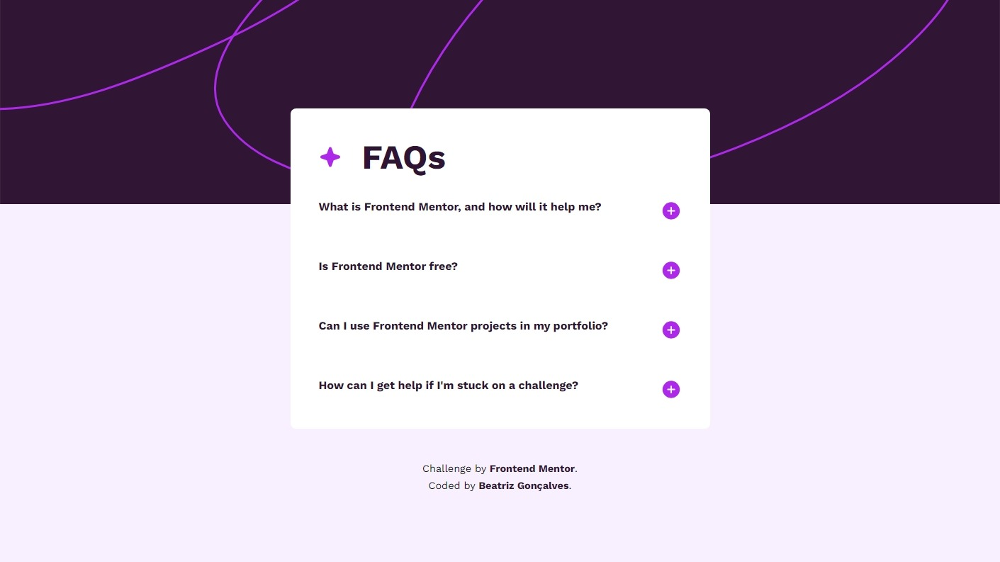
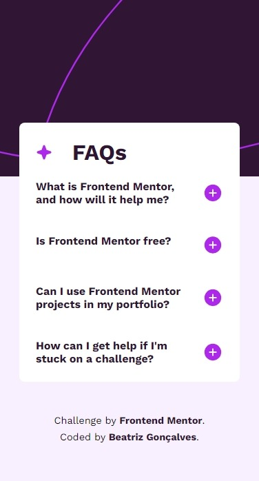

# Frontend Mentor - FAQ accordion solution

Essa é a solução para o [FAQ accordion challenge on Frontend Mentor](https://www.frontendmentor.io/challenges/faq-accordion-wyfFdeBwBz).  Os desafios do Frontend Mentor ajudam você a melhorar suas habilidades de codificação através da construção de projetos realistas.

## Tabela de conteúdo

- [Frontend Mentor - FAQ accordion solution](#frontend-mentor---faq-accordion-solution)
  - [Tabela de conteúdo](#tabela-de-conteúdo)
  - [Visão Geral](#visão-geral)
    - [O desafio](#o-desafio)
    - [Screenshot](#screenshot)
      - [Desktop:](#desktop)
      - [Mobile:](#mobile)
    - [Links](#links)
  - [Meu processo](#meu-processo)
    - [Construído com](#construído-com)
    - [O que eu aprendi](#o-que-eu-aprendi)
    - [Desenvolvimento contínuo](#desenvolvimento-contínuo)
  - [Autora](#autora)

## Visão Geral

### O desafio

Seus usuários devem ser capazes de:

- Ocultar/Mostrar a resposta a uma pergunta quando a pergunta é clicada
- Navegue pelas perguntas e oculte/mostre respostas usando apenas a navegação pelo teclado
- Exibir o layout ideal para a interface, dependendo do tamanho da tela do dispositivo
- Veja os estados de hover e focus para todos os elementos interativos na página

### Screenshot

#### Desktop:

#### Mobile:

### Links

- Solução URL: [Frontend Mentor](https://www.frontendmentor.io/solutions/faq-accordion-solution-rwKPjXyLkY)
- Site URL: [GitHub Pages](https://beatrizvsgoncalves.github.io/faq-accordion-main/)

## Meu processo

### Construído com

- Tags semânticas
- Flexbox
- Mobile-first workflow
- JavaScript

### O que eu aprendi

Já tinha visto nos meus estudos a encolher e expandir algo, mas foi bom ver como na prática algumas coisas são bem diferentes.

### Desenvolvimento contínuo

Foi muito bom fazer este desafio, pois percebi que devo voltar aos estudos antes de me aventurar novamente em desafios de JavaScript. Claro, experiência nunca é demais, mas devo focar no que mais importa agora no meu progresso.
Quanto aos desafios vou continuar fazendo os de HTML e CSS. E quando estiver mais conhecimento em JS irei voltar.

## Autora

- Github - [beatrizvsgoncalves](https://github.com/beatrizvsgoncalves)
- LinkedIn - [beatriz-vs-goncalves](https://www.linkedin.com/in/beatriz-vs-goncalves/)
- Frontend Mentor - [@beatrizvsgoncalves](https://www.frontendmentor.io/profile/beatrizvsgoncalves)